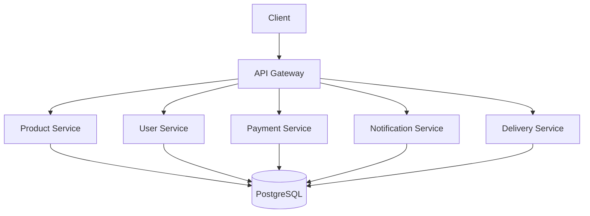

# Microservices Architecture with Go and Kubernetes

## Project Overview

A modern microservices-based application built with Go, featuring:

- **API Gateway** for routing and service orchestration.
- **Product Service** for product management.
- **User Service** for authentication and user management.
- **Payment Service** for transaction processing.
- **Notification Service** for alerts and communications.
- **Delivery Service** for shipment tracking.

Each service uses a PostgreSQL database for data storage.

## Architecture



Each service uses a PostgreSQL database for data storage.

## Technologies Used

- **Go** - Backend services
- **Docker** - Containerization
- **Kubernetes** - Container orchestration
- **PostgreSQL** - Database
- **Nginx** - API Gateway
- **gRPC** - Inter-service communication

## Project Structure

├── api-gateway/ # API Gateway service ├── product-service/ # Product management service ├── user-service/ # User authentication service ├── payment-service/ # Payment processing service ├── notification-service/ # Notification handling service ├── delivery-service/ # Delivery management service └── docker-compose.yml # Local development setup

## Getting Started

### Prerequisites

- **Go 1.21+** - Required for running Go-based services.
- **Docker & Docker Compose** - For containerization and local development.
- **Kubernetes** - Minikube for local development or a production-ready Kubernetes cluster.
- **PostgreSQL** - As the database for all services.

### Local Development Setup

1. **Clone the repository:**
   ```bash
   git clone https://github.com/yourusername/microservices-go.git
   ```
2. **Start the services using Docker Compose:**
   ```bash
   docker-compose up -d
   ```
3. **Initialize the databases for each service (e.g., Product Service)::**
   ```bash
   docker-compose exec product-service go run migrations/migrate.go up
   ```

## API Endpoints

### Product Service

- `GET /products` - List all products.
- `GET /products/{id}` - Get product by ID.
- `POST /products` - Create a new product.
- `PUT /products/{id}` - Update a product.
- `DELETE /products/{id}` - Delete a product.

### User Service

- `POST /users/register` - Register a new user.
- `POST /users/login` - User login.

### Payment Service

- `POST /payments` - Process a payment.
- `GET /payments/{id}` - Get payment status.

## Deployment

### Kubernetes Deployment

1. **Create necessary Kubernetes secrets:**

   ```bash
   kubectl create secret generic db-credentials --from-literal=password=yourpassword

   ```

2. **Apply the Kubernetes manifests:**
   ```bash
   kubectl apply -f k8s/
   ```

## License

This project is licensed under the MIT License - see the [LICENSE](LICENSE) file for details.

## Contact

- **Nick Shilov** - [@gauss2302](https://github.com/gauss2302)
- **Buymania Link**: [https://github.com/gauss2302/buymania_microserivce_k8_docker.git](https://github.com/gauss2302/buymania_microserivce_k8_docker.git)
