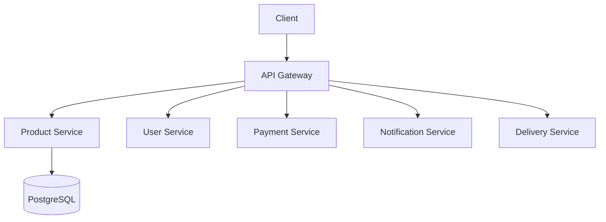

# Microservices Architecture with Go and Kubernetes

## Project Overview

A modern microservices-based application built with Go, featuring:

- API Gateway for routing and service orchestration
- Product Service for product management
- User Service for authentication and user management
- Payment Service for transaction processing
- Notification Service for alerts and communications
- Delivery Service for shipment tracking

## Architecture

